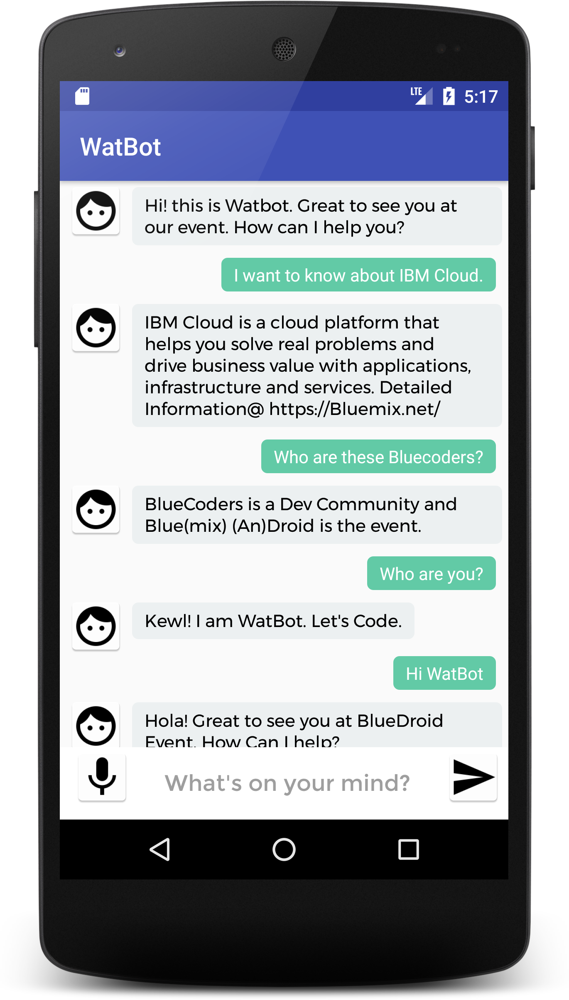

# WatBot - An Android ChatBot powered by IBM Watson

[](https://travis-ci.org/VidyasagarMSC/WatBot)

WatBot is an IBM Watson powered ChatBot running on <a href="https://vmacwrites.wordpress.com/category/android/" target="_blank">Android</a> and using Watson Assistant service on IBM <a href="https://vmacwrites.wordpress.com/category/cloud/" target="_blank">Cloud</a> (an open standards, cloud platform for building, running, and managing apps and services).
<p align="center"></p>

**Note:** This app uses Watson Assistant V1 API

<h2>Coding the app on Android Studio</h2>
Android Studio is the Official IDE for Android. Android Studio provides the fastest tools for building apps on every type of Android device.

Clone the [repo](https://github.com/VidyasagarMSC/WatBot) and import the code in Android Studio,

```
git clone https://github.com/VidyasagarMSC/WatBot.git
```
## Creation of Watson Assistant service; Adding intents & entities ; Building your dialog

Check this [blog post](https://vmacwrites.wordpress.com/2017/01/05/an-android-chatbot-powered-by-ibm-watson/) for step-by-step and up-to-date instructions.

## Configure the App

  <p>To configure  the App you need to get the Watson Assistant service's  <strong>Password</strong>, <strong>URL</strong> and <strong>Workspace ID</strong></p>

* In the <strong>MainActivity</strong> class locate the method named <strong>sendMessage()</strong>.
   On the **Manage** tab of the Assistant service you created, click **Launch tool** > Skills > Click the three vertical dots next to the Skill > View API Details > You can find the Workspace ID, Username and password. If you wish to use API Key directly read the TODO, uncomment the code and replace the Placeholder with the API Key value.

   You can find the **API Key** and URL on the Manage tab or under service credentials.
   ```
       Assistant assistantservice = new Assistant("2018-02-16");
        //If you like to use USERNAME AND PASSWORD
        //Your Username: "apikey", password: "<APIKEY_VALUE>"
        assistantservice.setUsernameAndPassword("apikey", "<API_KEY_VALUE>");

        //TODO: Uncomment this line if you want to use API KEY
        //assistantservice.setApiKey("<API_KEY_VALUE>");

        //Set endpoint which is the URL. Default value: https://gateway.watsonplatform.net/assistant/api
        assistantservice.setEndPoint("<ASSISTANT_URL>");
        InputData input = new InputData.Builder(inputmessage).build();
        //WORKSPACES are now SKILLS
        MessageOptions options = new MessageOptions.Builder().workspaceId("<WORKSPACE_ID>").input(input).context(context).build();
        MessageResponse response = assistantservice.message(options).execute();
   ```

 </p>Add the `password` in the following code,</p>


        assistantservice.setUsernameAndPassword("apikey", "<ASSISTANT_PASSWORD>");


* Next is to get the <strong>Workspace ID</strong>.

<p>Get the <strong>Workspace ID:</strong> and add it in the below code,</p>

       MessageOptions options = new MessageOptions.Builder("<Workspace_ID>").input(input).context(context).build();
Gradle Entry

    compile 'com.ibm.watson.developer_cloud:assistant:6.11.0'


* Build and Run your app.

## Enable Text to Speech

* Create a Watson Text to Speech(TTS) service on [IBM Cloud](https://console.ng.bluemix.net/catalog/services/text-to-speech/?taxonomyNavigation=apps)
* Navigate to Service Credentials tab and click on "View Credentials".

On Line 95 of MainActivity.java, replace the password and URL placeholders with the TTS service credentials

        textService.setUsernameAndPassword("apikey", "<TEXT_TO_SPEECH_APIKEY>");
        textService.setEndPoint("<TEXT_TO_SPEECH_URL>");

* Build and Run your app.

Now when you TAP on any message, the text will be heard via a Voice (Voice.EN_US_LISAVOICE). You can change the voice formats in the code (Line 120 0f MainActivity.java)

<strong>Note: </strong> The required gradle entries for TTS is already included in the build.gradle file
  ```
    compile 'com.ibm.watson.developer_cloud:text-to-speech:6.11.0'
    compile 'com.ibm.watson.developer_cloud:android-sdk:0.5.0'
  ```

## Enable Speech to Text

* Create a Watson Speech-To-Text (STT) service on [IBM Cloud](https://console.ng.bluemix.net/catalog/services/speech-to-text/?taxonomyNavigation=apps)
* Navigate to Service Credentials tab and click on "View Credentials".
* Update lines 274-276 with the credentials.
* Build and Run your app.

<strong>Note: </strong> The required gradle entries for STT is already included in the build.gradle file
   ```
        compile 'com.ibm.watson.developer_cloud:speech-to-text:6.11.0'
        compile 'com.ibm.watson.developer_cloud:android-sdk:0.5.0'
   ```

### Chat with your own WatBot

If you have followed all the above instructions, you should be happily chatting with your Wat(son)Bot.

** Remember your bot will be talking to your Watson Assistant service (Intents, Entities and Dialog).**

## Additional
Speaker labels

**Note:** The speaker labels feature is beta functionality that is available for US English, Japanese, and Spanish.

Speaker labels identify which individuals spoke which words in a multi-participant exchange. (Labeling who spoke and when is sometimes referred to as speaker diarization.) You can use the information to develop a person-by-person transcript of an audio stream, such as contact to a call center. Or you can use it to animate an exchange with a conversational robot or avatar. For best performance, use audio that is at least a minute long.

To enable, Click TODO on the bottom tab of Android Studio or search for TODO in MainActivity.java file and uncomment the lines. You should see the output in the logcat as shown below

```
SPEECHRESULTS: {
      "confidence": 0.5,
      "final": false,
      "from": 1.59,
      "speaker": 0,
      "to": 1.82
    }
```

### Don't stop here!!! Keep coding and using IBM Cloud
